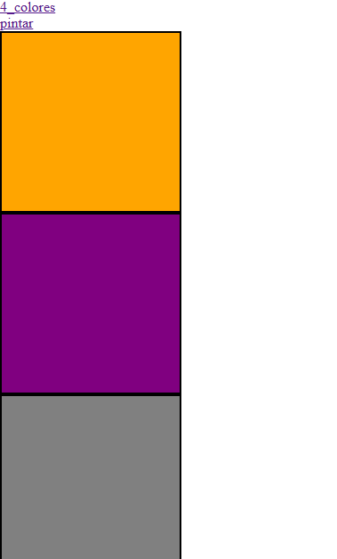

# Desafio-3.3 - Eventos de Teclado y Click

## Descripción
Proyecto de práctica que trabaja con manipulación del DOM mediante eventos de mouse (`click`) y teclado (`keydown`). Incluye ejercicios de cambio de color en elementos existentes, creación dinámica de elementos y paso de parámetros a funciones.

## Tecnologías

- HTML5
- CSS3
- JavaScript (Vanilla JS)

## Funcionalidades

- Cambio de color de un elemento al hacer click, recibiendo el elemento como parámetro de la función.
- Múltiples divs de colores que cambian a negro al hacer click.
- Div que cambia de color según la tecla presionada (`a`, `s`, `d`).
- Creación dinámica de nuevos divs al presionar teclas (`q`, `w`, `e`).

## Capturas de pantalla

## Demo

🔗 [Ver proyecto en GitHub Pages](https://camlo77.github.io/Desafio-3.3/)